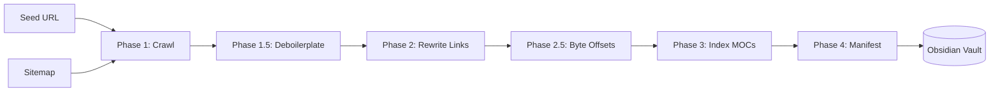
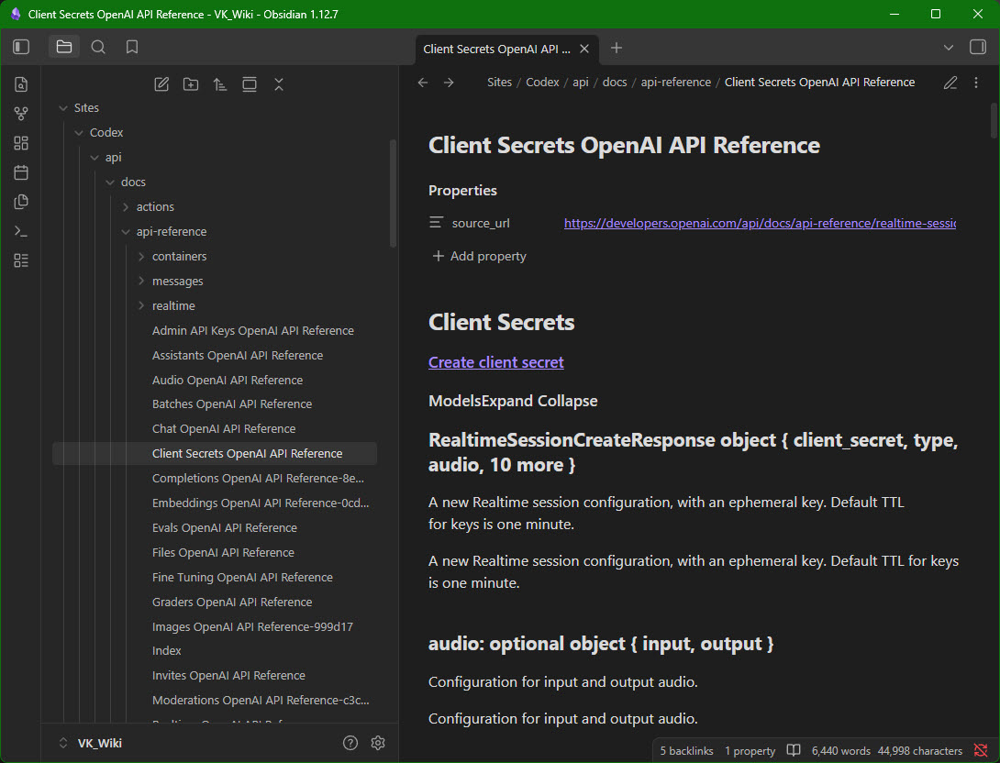

# Site2Vault

> Mirror any website into a linked Obsidian vault. Built for Claude Code and other agentic tools to read documentation offline at near-zero token cost.

[](https://www.python.org/)
[](LICENSE)

Site2Vault crawls a website, extracts the main content of each page as clean Markdown, and wires every internal link as an **Obsidian** `[[wikilink]]`. The result is a self-contained vault you can open in Obsidian, search across, and feed to Claude Code without paying for repeated web fetches.


## Why

Feeding documentation to an agentic coder via repeated web fetches burns tokens. A 200-page docs site can cost dollars per query. Site2Vault pulls the entire corpus once into a local Markdown vault. From then on, the agent reads files at near-zero cost, navigates by `[[wikilink]]` exactly as on the original site, and uses the manifest to read only the sections it needs.

As of April 2026 there are quite a few other tools that mirror sites to Markdown, but to the best of my knowledge none produce a ***fully interlinked Obsidian vault with a machine-readable corpus index designed for agentic consumption***. That gap is what ***site2vault***  fills.

## Install

### Standalone Windows executable (no Python required)

Download `site2vault-windows.zip` from the [dist](dist/) folder, extract, and add the folder to your `PATH`.

### Via pipx (isolated, recommended for end users)

```bash
pipx install site2vault
```

### Via pip (for development or embedding)

```bash
pip install -e .
```

Optional JS rendering for client-side-rendered sites:

```bash
pip install 'site2vault[js]'
playwright install chromium
```

### Obsidian plugin

If you prefer a GUI, the [obsidian-site2vault](https://github.com/vkorost/obsidian-site2vault) plugin wraps the CLI with a modal dialog, live log view, and settings tab — all inside Obsidian.

## Quick start

```bash
# Mirror a docs site into your Obsidian vault
site2vault --url docs.example.com --path C:\Obsidian\Vault --name "Example Docs"

# Capture a single page
site2vault --url example.com/page --single

# Refresh an existing vault (uses conditional GET, skips unchanged pages)
site2vault --url docs.example.com --path C:\Obsidian\Vault --name "Example Docs" --refresh
```

The vault that results:

```
Example Docs/
├── .site2vault/manifest.json    Machine-readable corpus index
├── Index.md                     Root Map of Content
├── api/
│   ├── Index.md                 Folder MOC
│   └── Endpoints.md
├── getting-started/
│   ├── Index.md
│   └── Installation.md
└── log/                         Crawler internals (SQLite, headings, link sidecars)
```

Example of the OpenAI site in my Obsidian vault -



## Common recipes

```bash
# Full docs site with tags
site2vault --url docs.api.com --path ./vault --tag source/web --tag reference

# Restricted scope: only /api/* under the seed
site2vault --url example.com --include "^https://example\.com/api/" --depth 6

# Multiple sites in one vault, isolated by namespace
site2vault --url docs.example.com --path ./vault --namespace docs
site2vault --url blog.example.com --path ./vault --namespace blog

# Slow and polite for fragile sites
site2vault --url small-site.com --rate 0.3 --concurrency 1 --jitter 0.5

# Discovery only (no files written)
site2vault --url docs.example.com --dry-run --max-pages 100
```

See [docs/cli-reference.md](docs/cli-reference.md) for every flag.

## How it works

Six phases, orchestrated by `orchestrator.py`:

1. **Crawl** — Breadth-first frontier with politeness controls. Fetches via `httpx` (HTTP/2), extracts main content with `trafilatura`, converts to Markdown with placeholder link tokens.
2. **Deboilerplate** — Cross-page paragraph frequency analysis removes repeated cruft like "Edit on GitHub" footers.
3. **Rewrite** — Replaces placeholder tokens with `[[wikilinks]]` for in-vault pages or `[text](url)` for external links.
4. **Byte offsets** — Computes heading byte offsets in the final Markdown for section-level reading.
5. **Index** — Generates root and per-folder Maps of Content.
6. **Manifest** — Writes `.site2vault/manifest.json` with per-note metadata (headings, links, word counts, byte offsets).

For the full architecture, see [docs/architecture.md](docs/architecture.md).

## For Claude Code

Site2Vault is designed for agentic consumption. The single most important fact:

> **Read `.site2vault/manifest.json` first.** It tells you every note, every heading, every link, and every byte offset, without scanning a single Markdown file.

Then read only what you need, by section if possible:

```python
# Find the section that covers what you need
import json
manifest = json.load(open("vault/.site2vault/manifest.json"))
for note in manifest["notes"]:
    for h in note["headings"]:
        if "authentication" in h["text"].lower():
            with open(f"vault/{note['file']}", "rb") as f:
                f.seek(h["start_byte"])
                section = f.read(h["end_byte"] - h["start_byte"]).decode()
            # done. one section, not the whole file.
```

Full guide: [docs/claude-integration.md](docs/claude-integration.md).

## Documentation

- [Architecture](docs/architecture.md) — pipeline phases, module map, design decisions
- [CLI reference](docs/cli-reference.md) — every flag, every default
- [Claude integration](docs/claude-integration.md) — how to consume vault output efficiently
- [Troubleshooting](docs/troubleshooting.md) — common failures and fixes
- [Development](docs/development.md) — setup, testing, building

## License

MIT. See [LICENSE](LICENSE).

## Acknowledgments

Built on [trafilatura](https://github.com/adbar/trafilatura), [httpx](https://www.python-httpx.org/), [markdownify](https://github.com/matthewwithanm/python-markdownify), and [Obsidian](https://obsidian.md/).
